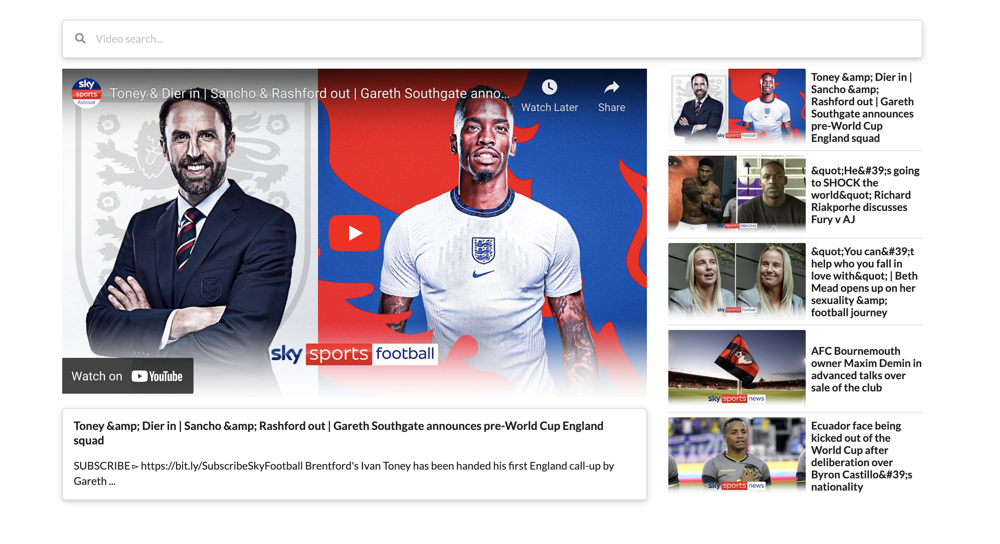

## A simple youtube API searcher

> Using the youtube API to search for content.

Featuring:

- This is a [React.js](https://reactjs.org/) project bootstrapped with [create-react-app](https://create-react-app.dev/).
- [Axios](https://axios-http.com/) provides all data fetching requests.
- Styling is assisted by using [semantic ui](https://semantic-ui.com/).

Regards,  
Luigi Lupini  
 
I ❤️ all things (🇮🇹 / 🛵 / ☕️ / 👨‍👩‍👧) 
